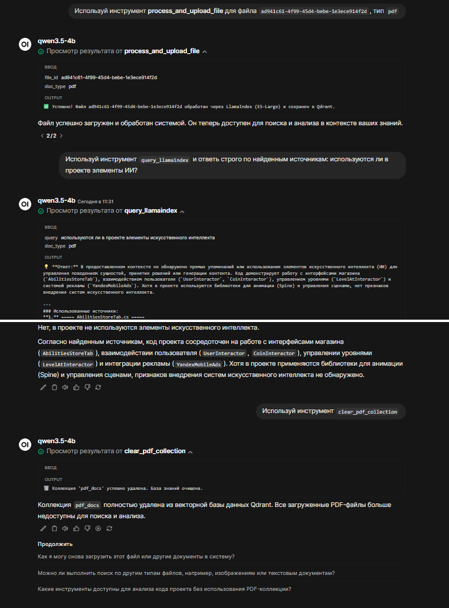

# Назначение: 
Ускорение работы с крупными pdf и кодовой базой.

Может использоваться для проверки студенческих выпусных квалификационных работ по ИТ специальностям, включающим текст пояснительной записки в формате pdf и комплект кодовой базы. 

# Среда для выполнения. 
Тестирование осуществлялось на ПК со следующими параметрами:
* Ubuntu 22.04
* 256 Gb RAM
* x2 Intel(R) Xeon(R) CPU E5-2697 v4 @ 2.30GHz
* RTX 3050 8 Gb VRAM
* 2 TB NVMe

Настройка:
```bash
cd ~
git clone https://github.com/danil1online/llama_index_open_webui.git lm_studio_webui_docker
```
# 1. Выбор и запуск LLM 
## 1.1. Вариант №1. Рекомендуемый. Установить [LM Studio GUI](https://lmstudio.ai/). Например, через deb-файл:
```bash
sudo apt install ./LM-Studio-0.4.6-1-x64.deb
```
1.1.1. Найти и скачать через GUI модель unsloth/Qwen3.5-4B-GGUF, загрузку модели не осуществлять.

1.1.2. На вкладке "My models" на модели нажать шестеренку (настройки) и в правом окне в средней вкладке "Load" задать размер контекста "32768".

1.1.3. Включить сервер и в нем: "Serve on Local Network", "Enable CORS", "Just-in-Time Model Loading", "Auto unload unused JIT loaded models", "Max idle TTL" - 5 min.

1.1.4. Настраиваем автозагрузку
```bash
sudo apt install xvfb libfuse2 libx11-6 
sudo nano /etc/systemd/system/lmstudio.service
```
внутри
```sh
[Unit]
Description=LM Studio API Server
After=network.target nvidia-persistenced.service

[Service]
# Укажите своего пользователя, чтобы сервер имел доступ к конфигам моделей
User=user1
Group=user1
WorkingDirectory=/home/user1

Environment=DISPLAY=:99
# Запуск через xvfb, чтобы приложение думало, что есть монитор
ExecStart=/usr/bin/xvfb-run --server-args="-screen 0 1024x768x24" /usr/bin/lm-studio
Restart=always
RestartSec=5

[Install]
WantedBy=multi-user.target
```
 -> `Ctrl+O` -> `Ctrl+X`

Сам автозапуск
```bash
sudo systemctl daemon-reload
sudo systemctl enable lmstudio.service
sudo systemctl start lmstudio # может ругаться, что такое приложение уже запущено
sudo reboot
```
### 1.2. Вариант №2. Запустить [Ollama](https://ollama.com/) рядом в docker'е. 

Представляется не оптимальным, но реализован и проходит тестирование. 

Неоптимальность заключается в том, что те же модели в таком случае больше "рассуждают" и дают результат дольше. 

Тестируется в ollama version is 0.17.7

1.2.1. Создать отдельный каталог
```bash
mkdir ../ollama && cd ../ollama
nano docker-compose.yml
```
Внутри 
```sh
services:
  ollama:
    image: ollama/ollama:latest
    container_name: ollama
    ports:
      - "11434:11434"
    volumes:
      - ollama_data:/root/.ollama
    deploy:
      resources:
        reservations:
          devices:
            - driver: nvidia
              count: all
              capabilities: [gpu]

volumes:
  ollama_data:
```
 -> `Ctrl+O` -> `Ctrl+X`

```bash
docker compose up -d
```

1.2.3. Загрузка моделей 
```bash
docker exec -it ollama ollama pull qwen3.5:4b
docker exec -it ollama ollama pull qwen3.5:9b
```

1.2.4. Правки исходников:

1.2.4.1. [server.py](llamaindex/server.py)
```python
api_base="http://host.docker.internal:1234/v1" 
```
 -> 
```python
api_base="http://host.docker.internal:11434/v1"
```
```python
model="qwen3.5-4b"
```
 -> 
```python
model="qwen3.5:4b"
```
 
1.2.4.2. [settings.py](llamaindex/settings.py)
```python
lms_url: str = os.getenv("LMS_URL", "http://host.docker.internal:1234/v1")
```
 -> 

```python
lms_url: str = os.getenv("LMS_URL", "http://host.docker.internal:11434/v1")
```
```python
llm_model: str = os.getenv("LLM_MODEL", "qwen3.5-4b")
```

 -> 
```python 
llm_model: str = os.getenv("LLM_MODEL", "qwen3.5:4b")
```

1.2.5. Возврат в исходный каталог 
```bash
cd ../lm_studio_webui_docker
```

# 2. Запуск [основного сервиса]
```bash
docker compose up -d
```
2.1. Загрузка будет долгой -- llamaindex на базе python:3.11 будет скачивать все модели в соответствии с:

[requirements.txt](llamaindex/requirements.txt)

[preload_models.py](llamaindex/preload_models.py)

2.2. За процессом лучше всего наблюдать командной
```bash
docker logs -f llamaindex
```

# 4. Регистрируемся в open-webui (version 0.8.10), порт 2999.

# 5. Добавляем инструменты для работы

вверху слева "Рабочее пространство" - ввеху последний пункт "Инструменты". 

Добавляем (названия указываем три раза, обязательно сохраняем):

### 5.1. Для простейшего тестирования моделей - [echo](tools_text/echo.py). 
Тестирование модели нужно, чтобы выбрать оптимальную, которая точно будет вызывать инструменты, а не анализировать документ. 
### 5.2. Для получения индекса UUID загружаемого документа в БД Open-WebUI [get_file_index](tools_text/get_file_index.py)
### 5.3. Для загрузки документа с известным UUID в llama_index [process_and_upload_file](tools_text/process_and_upload_file.py)
### ОБЯЗАТЕЛЬНО 
для данного параметра задать КЛЮЧ API -- записать в параметры Инструмента:

5.3.1. слева внизу имя пользователя - "Настройки" - слева "Учетная запись" - "Ключи API", "Показать" - скопировать.

5.3.2. возле названия Инструмента шестеренка - нажать на "По умолчанию", изменится на пользовательских, вставить включ из п. 5.3.1 и "Сохранить". 

### 5.4. Запрос сведений из llama_index [query_llamaindex](tools_text/query_llamaindex.py)
### 5.5. Очиста Qdrant в части коллекции pdf из llama_index [clear_pdf_collection](tools_text/clear_pdf_collection.py)
## Функции работы с code collection **в работе** 
# 6. Настраиваем работу модели в open-webui:
## 6.1. На момент составления данной инструкции лучше всего работала модель Qwen3.5-4B, она подключалась из:
* встроенного в тот же docker-compose.yml Ollama (на данный момент [закоменнтировано](docker-compose.yml#L4)) через спец. "Подключение" "Ollama API" в Open-WebUI
* сервер LM Studio через "Подключение" "API OpenAI" в Open-WebUI: http://host.docker.internal:1234/v1 -- данный вариант настроен в docker-compose.yml "по умолчанию"
* сервер Ollama-docker-compose.yml через "Подключение" "API OpenAI" в Open-WebUI: http://host.docker.internal:11434/v1 -- данный вариант настроен вручную, тестируется

### Для подключения, например, LM Studio проверить:
* внизу слева – «Панель администратора» - вверху "Настройки" - слева "Подключения"
* в поле "Управление соединениями API OpenAI" - "http://host.docker.internal:1234/v1"

### Подключение open-webui с ollama имено через поле API Ollama в "Подключения" open-webui ненадежно:
* в таком случае используется собственный встроенный в Ollama механизм обработки Tools, тогда модели часто ленятся выполнять инструменты.
* аналогичное поведение было, если подключать ollama, включенную в docker-compose.yml основного проекта
## 6.2. **имя пользователя внизу слева** – **«Панель администратора»** - **вверху "Настройки"** - **слева "Модели"** - **"карандаш" напротив названия нужной**

Далее * отмечены необязательные / тестовые настройки.

6.3.* Находим "Инструменты" - отмечаем галочками echo, get_file_index, process_and_upload_file, query_llamaindex -- теперь в любом новом чате с этой #моделью они будут подключаться автоматически. Если будут доступны сразу все инструменты, то модель может пробовать запустить все подряд. 

6.4. Находим "Возможности", проверяем галочку на "Встроенные инструменты".

6.5. Под "Системный промпт" находим "Расширенные параметры" и раскрываем (справа "Показать") 

6.5.1. в строке "Вызов функции" ставим "Нативно". 

6.5.2.* в строке "Температура" ставим 0.2 -- для Qwen3.5-4B-Q4_K_M.gguf не настраивал и так хорошо работает. 

6.6.* Чтобы модель Qwen (или любая другая) правильно строила цепочку действий, настройте системный промпт в Open WebUI (Settings -> Models -> [Ваша модель] -> System Prompt):

```sh
Ты — экспертный ассистент с доступом к локальной базе знаний LlamaIndex.
Твои правила работы:
- Если пользователь загрузил файл, сначала используй get_file_index для получения UUID, а затем process_and_upload_file для его индексации.
- Если пользователь задает вопрос по содержимому документов (например, "О чем этот файл?", "Найди в документах..."), ВСЕГДА используй инструмент query_llamaindex.
- Если ответ из инструмента query_llamaindex содержит информацию, строй свой ответ на её основе. Если информации недостаточно, честно скажи об этом.
- Всегда уточняй doc_type (pdf или code), исходя из контекста вопроса.
```

6.7. Обязательно "Сохранить и обновить". 

# 7. Настраиваем и тестируем чат:
7.1. Если не настраивали внутри модели через панель администратора, то ОБЯЗАТЕЛЬНО:

Новый чат - справа вверху кнопка настроек чата (знак -- три горизонтальных бегунка) - "Расширенные параметры" - проверить, что "Вызов функции" -- "Нативно"

7.2. Под полем ввода ввода команд необходимо выбирать **один** конкретный инструмент в поле чата 

echo, get_file_index, process_and_upload_file, query_llamaindex, clear_pdf_collection

Иначе "услужливая" модель пытается запустить все поряд.  

7.3. Примеры запросов:

7.3.1. Проверка простая

```
Используй tool `echo` применительно к тексту "привет"
```

Должна появиться зеленая галочка с текстом "Просмотр результата от echo".

7.3.2. Получение ID файла в БД:

7.3.2.1. Загрузить в чат файл и написать

```
Не используй встроенный поиск, используй инструмент `get_file_index` для анализа файла. Необходимо получить на выходе не имя файла, а UUID 
```
7.3.2.2. Определить UUID: 

раскрыть п.п. зеленой галочки с текстом `Просмотр результата от get_file_index`, там будет ответ вида 7e3d2e20-4b72-4b33-83a4-e87ec27dd287

7.3.3. Загрузка файла в llamaindex

``` 
Используй инструмент `process_and_upload_file` для файла ad941c61-4f99-45d4-bebe-1e3ece914f2d, тип `pdf`
```

7.3.4. Вопросы по данным llamaindex
```
Используй инструмент `query_llamaindex` и ответь строго по найденным источникам в pdf: используются ли в проекте элементы ИИ?
```

7.3.5. Очистка llamaindex
```
Используй инструмент `clear_pdf_collection`
```


# 8. Дополнительные инструкции:
   
## 8.1. Для удаления лишних файлов, которые были загружены пока проходило тестирование:

слева внизу имя пользователя - "Настройки" - слева "Управление данными" - внизу "Manage Files", слева "Управление" - значек корзины справа

## 8.2. Сверка с реальными UUID:

8.2.1. слева внизу имя пользователя - "Настройки" - слева "Управление данными" - внизу "Manage Files", слева "Управление"

8.2.2. F12 (режим разработчика) - вверху вкладка "Network"

8.2.3. Нажимаем нужный файл в списке файлов в основном окне 

8.2.4. В окне разработчика справа находим в столбце "Name" что-то вида "7e3d2e20-4b72-4b33-83a4-e87ec27dd287"

## 8.3. Перекомпиляция сервисов в случае изменения постащика (LM Stduio | Ollama) 

```bash
cd /home/user1/lm_studio_webui_docker
docker compose down
docker compose up -d --build
```

# License

This project is licensed under the [CC-BY 4.0](https://creativecommons.org/licenses/by/4.0/) license. See the [LICENSE](./LICENSE) file for details.
